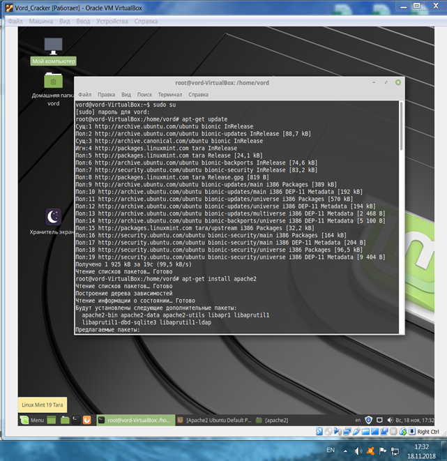
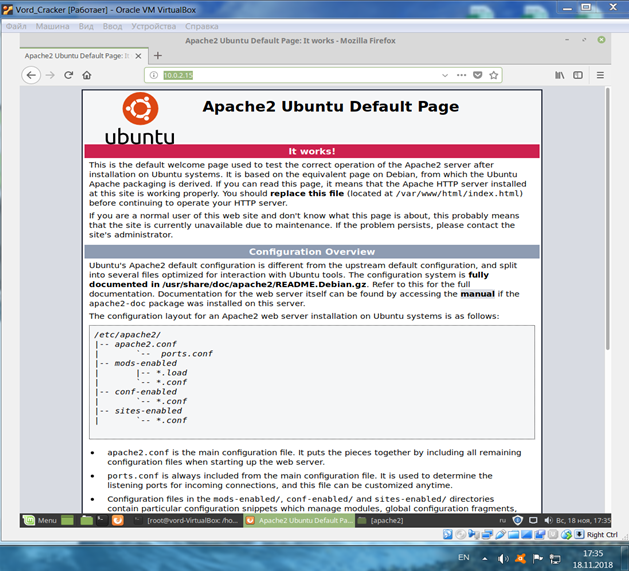
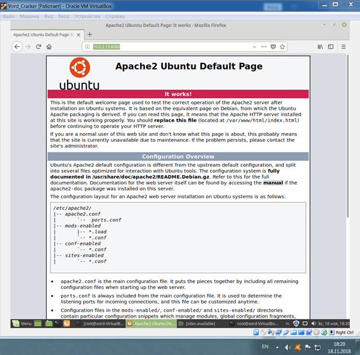
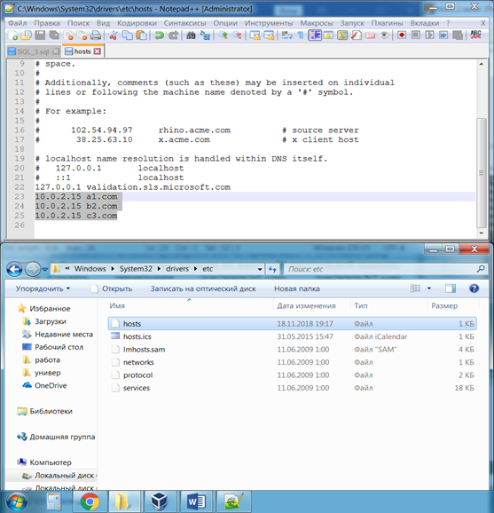
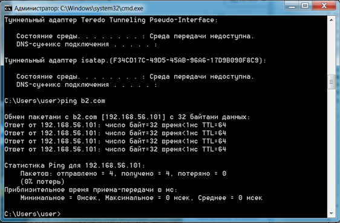
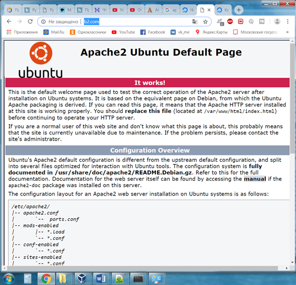
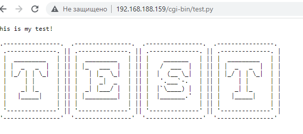

Установка и запуск веб-сервера в Linux
--------------------------------------

### Цель работы

Освоить основные навыки установки и первоначальной настройки веб-сервера в ОС Linux.

### Задания для выполнения

1.  Используя apt-get установить Apache2 на виртуальную машину
2.  С браузера хост-машины по IP-адресу виртуальной машины увидеть приветствие
3.  В настройках сервера изменить  порт на :8080
4.  Снова выполнить п 2, но с указанием порта
5.  Изменить порт обратно и проверить как работает заглушка
6.  Запустить сервер Apache на портах 80 и 8080 одновременно и проверить работу
7.  В hosts хост-машины создать три домена: a1.com, b2.com, c3.com и связываем с IP виртуальной машины с Apache
8.  Для каждого домена проверить всё ли правильно, с помощью ping
9.  Зайти на все три домена, написав их вместо IP виртуальной машины
10.  Создать директории /var/www/a1.com, /var/www/b2.com, /var/www/c3.com
11.  В каждой из них создать пустой index.html
12.  В каждом из них написать различное содержимое
13.  Сделать так, чтобы из браузеров хост-машины открывались сайты из директории, а не общая заглушка
14.  Запустить на выполнение скрипт, проверить отображение его в браузере:
```
#!/usr/bin/python3

from art import \*

Art=text2art("TEST",font='block',chr\_ignore=True)

print('Content-Type: text/plain')

print('')

print('This is my test!')

print(Art)
```
### Методические указания

1\. Заручившись правами root, выполните в консоли команду *apt-get update*, а после того и *apt-get install apache2*. Вы должны увидеть стандартный вывод программы-установщика пакета.  
  
  
2\. Узнав ip виртуалки через ifconfig, вбейте его в адресную строку браузера хост-машины. Вы должны увидеть стандартную страницу-заглушку приветствия веб-сервера. То же самое можно наблюдать в браузере самой Linux-машины по адресу localhost или 127.0.0.1



3\. Apache каждому пользователю свои конфигурационные файлы редактировать не даёт. Поэтому нужно либо разрешить изменение этих файлов своему пользователю через chmod, либо выполнять все настройки используя sudo.

Далее поменяйте в /etc/apache2/ports.conf либо /etc/apache2/httpd.conf строчку Listen 80 на Listen 8080.

Ещё в /etc/apache2/sites-available/default строчку 
```
<VirtualHost \*:8080>
```
После этого выполните
```
systemctl restart apache2.service
```
чтобы все изменения заработали

4\. Проверим через браузер возможность работы через нестандартный порт, вбив адрес localhost:8080 либо 127.0.0.1:8080

5\. Через консоль можно использовать текстовый браузер Lynx (apt install lynx)
```
$lynx 127.0.0.1
```


6.        Найдите на хост машине файл hosts. Там необходимо дописать 3 строчки



7.        На этапе проверки выяснится, что NAT для таких дел не подходит, потому как к машине за NAT нельзя обратиться из внешней сети. С сетевым мостом тоже не все гладко, ВМ просто не может подключиться к нему.

Идеальный тип сетевого адаптера зависит от того, с каких машин мы планируем подключаться к серверу на виртуальной машине. Если нам нужно работать только с хост машины, нам больше всего подходит виртуальный адаптер хоста.



8.        А вот и тест сайта с браузера машины-хоста

  
  
9\. Настройка запуска скриптов:

Включите модуль под названием CGID.
```
#a2enmod cgid
```
Для формирования изображения буду использовать библиотеку ART
```
#pip3 install art
```
Доступ к cgi каталога Apache. Место хранения скриптов CGI-BIN: /usr/lib/cgi-bin

Создать файл со скриптом /usr/lib/cgi-bin/test.py
```
#!/usr/bin/python3

from art import \*

Art=text2art("TEST",font='block',chr\_ignore=True)

print('Content-Type: text/plain')

print('')

print('This is my test!')

print(Art)
```
Измените разрешение файла.
```
chmod 755 /usr/lib/cgi-bin/test.py
```
Откройте браузер и введите IP-адрес вашего веб-сервера плюс /cgi-bin/test.py.

В нашем примере в браузер был введен следующий URL:

[http://hostname/cgi-bin/test.py](https://www.google.com/url?q=http://hostname/cgi-bin/test.py&sa=D&source=editors&ust=1710150851467040&usg=AOvVaw1GL8PNAGLIEnpIQ920xFao)

Страница Python должна отображать следующее сообщение.



### Контрольные вопросы

1.  Что такое веб-сервер и для чего нужна эта программа?
2.  Что такое рабочая директория веб-сервера?
3.  Основные настройки сервера Apache. Файл настроек.
4.  Что такое виртуальные хосты веб-сервера? Как настроить их в Apache?
5.  Что такое файл hosts, где он находится в Windows и Linux, какой его формат и для чего он нужен?
6.  Какова основная структура HTML-файла?

### Дополнительные задания

1.  Повторите все задания лабораторной работы, используя nginx в качестве рабочего веб-сервера вместо Apache2.
2.  Напишите простой веб-клиент, запрашивающий у пользователя имя хоста и идентификатор ресурса (файла) и обращающийся к веб-серверу на этом хосте по методу GET, запрашивая данный ресурс.