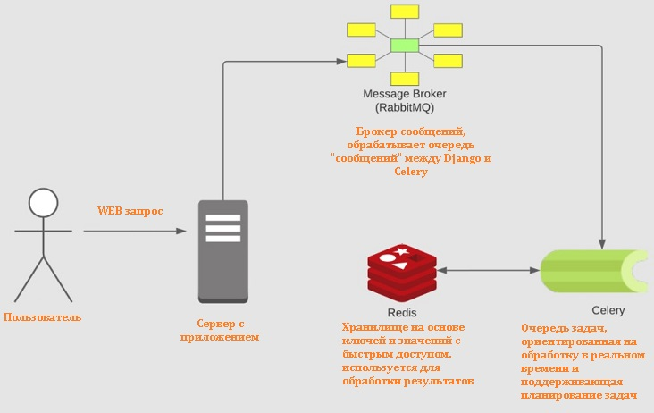

Асинхронные задачи в Python + Celery + RabbitMQ + Redis
=======================================================

* * *

  
**Асинхронные задачи в Python + Celery + RabbitMQ + Redis**

  
**По мотивам статьи:**  
[https://levelup.gitconnected.com/asynchronous-tasks-in-python-with-celery-rabbitmq-redis-480f6e506d76](https://levelup.gitconnected.com/asynchronous-tasks-in-python-with-celery-rabbitmq-redis-480f6e506d76)

**Репозитория:**

[https://github.com/vjanz/python-asynchronous-tasks](https://github.com/vjanz/python-asynchronous-tasks)

---

## Немного теории



**Celery** \- очередь задач, ориентированная на обработку в реальном времени и поддерживающая планирование задач

**RabbitMQ** - брокер сообщений, обрабатывает очередь "сообщений" между **Django** и **Celery**

**Redis** \- хранилище на основе ключей и значений с быстрым доступом, используется для обработки результатов

В этой статье мы собираемся использовать **Celery**, **RabbitMQ** и **Redis** для создания распределенной очереди задач

Распределенная очередь задач позволяет вам переложить работу на другой процесс, чтобы она выполнялась асинхронно

Как только вы помещаете работу в очередь, то не ждете и параллельно используете другие ядра для обработки задач

Таким образом, это дает возможность выполнять задачи в фоновом режиме, когда приложение решает другие задачи

  
**Варианты использования очередей задач**

Самый простой пример - отправка электронных писем после регистрации пользователя

В этом случае вы не знаете, сколько времени потребуется, чтобы отправить электронное письмо пользователю

Это может быть 1 мс, но может быть и больше, а иногда даже не будет отправлено вообще

В этих сценариях вы не знаете, что задача будет успешно выполнена, потому что это сделает провайдер

  
**Категории для очередей задач**

**Сторонние задачи**

Веб-приложение должно обслуживать пользователей, не дожидаясь завершения других действий при загрузке страницы

Например отправки электронного письма или каких-то уведомлений

**Длительные задания**

Задания, требующие значительных ресурсов, когда пользователи ждут, пока они вычислят свои результаты

Например, выполнение сложного рабочего процесса, генерация графа, обработка видео

**Периодические задачи**

Задания, которые планируется запускать в определенное время или через определенный интервал

Например, создание ежемесячного отчета или веб-парсер, который запускается два раза в день

  
**Зависимости для Celery**

Celery требует транспорта для отправки и получения сообщений

**Некоторые кандидаты в качестве брокера сообщений:**  
RabbitMQ  
Redis  
Amazon SQS

Мы будем использовать **RabbitMQ** в качестве брокера

Предпочтительно использовать **RabbitMQ**, т.к. **Celery** изначально поддерживает его и просто работает

Когда задачи отправляются брокеру, а затем выполняются **celery worker**, мы хотим:  
сохранить состояние  
посмотреть, какие задачи выполнялись ранее

Для этого вам понадобится какое-то хранилище данных, и для этого мы будем использовать **Redis**

**Для хранилищ результата так-же существует много кандидатов:**  
AMQP, Redis  
Memcached,  
SQLAlchemy, Django ORM  
Apache Cassandra, Elasticsearch, Riak, etc

**Для настройки этих сервисов мы будем использовать Docker:**  
Его легко настроить  
Это изолированная среда  
Легко воспроизвести среду, когда есть конфигурация (**Dockerfile** или **docker-compose**)

  
## Настройка проекта

**Создадим новый каталог и необходимые для проекта файлы:**
```  
$ mkdir /tmp/mysite && cd /tmp/mysite  
$ touch docker-compose.yml requirements.txt tasks.py
```
**Создать и активировать виртуальную среду:**  
```
$ python -m venv env  
$ source env/bin/activate
```
**Теперь установим зависимости проекта из requirements.txt:**
```
amqp==5.0.6  
billiard==3.6.4.0  
celery==5.0.5  
click==7.1.2  
click-didyoumean==0.0.3  
click-plugins==1.1.1  
click-repl==0.2.0  
kombu==5.1.0  
prompt-toolkit==3.0.18  
pytz==2021.1  
redis==3.5.3  
six==1.16.0  
vine==5.0.0  
wcwidth==0.2.5
```
**Для данного проекта нам понадобятся Celery и Redis:**  

    $ pip install celery==5.0.5 redis 

Настроим docker-compose для запуска **RabbitMQ** и **Redis**

В файле **docker-compose.yaml** вставьте следующую конфигурацию YAML:  

```yaml
version: "3"
services:
  rabbitmq:
    image: rabbitmq:latest
    environment:
      - RABBITMQ_DEFAULT_USER=guest
      - RABBITMQ_DEFAULT_PASS=guest
    ports:
      - "5672:5672"
  redis:
    image: redis:latest
    ports:
      - "6379:6379"
```

**Здесь мы запускаем две службы:**  
- определяем образы из dockerhub  
- сопоставляя порты   
- добавляем переменные среды

Чтобы узнать, переменные среды для вашего образа - перейдите к документации образа в **dockerhub**

**Инициализируем приложение celery для использования:**  
- RabbitMQ в качестве транспортера сообщений  
- Redis в качестве хранилища результатов

**В tasks.py вставим следующий код:** 
```py 
from celery import Celery
from time import sleep

broker_url = "amqp://localhost"
redis_url = "redis://localhost"
app = Celery('tasks', broker=broker_url, backend=redis_url)

@app.task
def say_hello(name: str):
    sleep(5) 
    return f"Hello {name}"
```
Мы определили **URL**\-адреса для **RabbitMQ** и **Redis**

Затем инициализируем приложение **celery**, используя эти конфигурации

Первым параметром задачи является имя текущего модуля

Функция **say\_hello** с атрибутом **@app.task** (помечена как задача, может вызваться с помощью **.delay()**)

  
## Создаем и запускаем сервисы с помощью Docker

**Запускаем службы (RabbitMQ и Redis) с помощью докера:**  

    $ docker-compose up -d 

**Убедиться, что контейнеры запущены и работают:**  

    $ docker ps

Должны увидеть две запущенные службы и дополнительную информацию для каждой из них

Запустим **celery worker**, затем попробуем запустить некоторые задачи с интерактивной оболочкой python

**Запуск воркера Celery**  

    $ celery -A Tasks Worker -l info --pool=solo

**Теперь запустим задачу из интерактивной оболочки:**  

```
$ python
---------------------------------
Type "help", "copyright", "credits" or "license" for more information.
>>> from tasks import say_hello
>>> say_hello.delay("Test_Arg_Name_1")
<AsyncResult: 32as92a9-e7eb-22r1-9b22-x18b20d9d4g1>
```

Мы вызвали функцию **say\_hello**, используя **.delay()**, затем передали аргумент **Test\_Arg\_Name\_1**

Затем мы получаем **AsyncResult**, который является задачей, которая была передана брокеру

После этого данная задача будет обработана и завершена **Celery** в фоновом режиме

В логах воркера получена задача

Через 5 секунд **(sleep(5)**) сообщит, что задача успешно завершена

Повторим запуск задачи, но теперь добавим хранилище результатов **Redis**

В оболочке python давайте сохраним результат в переменной, а затем запустим ее свойства

```
$ python
---------------------------------
Type "help", "copyright", "credits" or "license" for more information.
>>> from tasks import say_hello
>>> result = say_hello.delay("Test_Arg_Name_1")
>>> result.status
'PENDING'
>>> result.status
'SUCCESS'
>>> result.get()
'Hello Test_Arg_Name_1'
```

**PENDING** и **SUCCESS** - состояния, которые мы успеваем увидеть т..к сделали исскуственную задержку **sleep(5)**

Если б не был настроен бэкэнд **Redis** на **Celery**, мы не могли получить доступ к свойствам или функциям

По умолчанию не хранятся состояния, но поскольку **Redis** есть, мы можем получать информацию о задачах

* * *