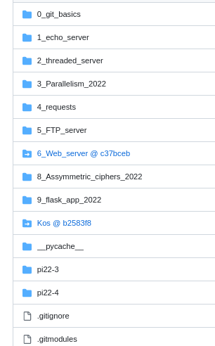

# Простейшие TCP live stream video server и client

### Цель работы

Познакомиться с приемами работы с сетевыми сокетами, созданием сервера потоковового аудио и видео в языке программирования Python.

За успешное выполнение зачисляется бал за echo_server + бал за submodule
## Задания для выполнения

- Сделать fork [репозитория](https://github.com/VladimirAndropov/7_TCP_server) со своим именем *Vasya_server*

- Cклонировать в ваш IDE (vscode, pycharm, ...)
- Выполнить задание из README

- Затем запушить  репозиторий *Vasya_echo_server* на github, не забыв вложить скриншот работы клиента и сервера. Не забудьте и про .gitignore, чтобы в вашем *Vasya_echo_server* не было катaлогов *venv, idea, ...*

- После чего открыть в вашей IDE глобальный репозиторий со всей практикой *Фамилия-fa-np-practice* и добавить репозиторий *Vasya_echo_server* как субмодуль (например на скриншоте Kos@b258316 - субмодуль)

- Вновь запушить изменения репозитория *Фамилия-fa-np-practice* на github

